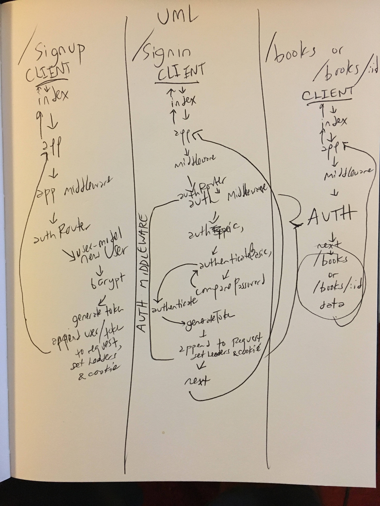

 LAB
=================================================

## Lab 11: Authentication

### Author: Joseph Wolfe

### Links and Resources
* [PR](https://github.com/charmedsatyr-401-advanced-javascript/lab-11/pull/1)
* [](https://travis-ci.org/charmedsatyr-401-advanced-javascript/lab-11)
* [front end](https://banana-sundae-76922.herokuapp.com/)

#### Documentation
* [jsdoc](https://banana-sundae-76922.herokuapp.com/docs)

### Modules

`./index.js`

`./src/app.js`

`.src/auth/middleware.js`

`.src/auth/router.js`

`.src/auth/users-model.js`

`.src/middleware/404.js`

`.src/middleware/error.js`

`.src/routes/books.js`

-----

#### `./index.js`
##### Exported Values and Methods from `./index.js`
This is the entry point of the application. When the app starts, the database connections are initiated.

-----

#### `.src/app.js`
##### Exported Values and Methods from `./src/app.js`
This module instantiates the app, sets middleware, routes, and controllers, and exports an `app` and `start` method for the Express server.

-----

#### `.src/auth/middleware.js`
##### Exported Values and Methods from `middleware.js`
This authentication middleware splits the user's request headers and uses internal methods `_authBasic` and `_authenticate`, and their internal calls, to further parse and validate them. Internal method `_authError` handles errors from invalid request headers.

-----

#### `.src/auth/router.js`
##### Exported Values and Methods from `router.js`
This module provides routes and associated handlers for the following authentication routes:

* `/signup` → used to create a new user account
* `/signin` → used to authenticate a session

Both of these routes take `POST` requests.

The module exports an Express `router` object used in `./src/app.js`.

-----

#### `.src/auth/users-model.js`
##### Exported Values and Methods from `users-model.js`
This module defines a mongoose schema `Users` with the following properties:
```
  username: { type: String, required: true, unique: true },
  password: { type: String, required: true },
  email: { type: String },
  role: { type: String, required: true, default: 'user', enum: ['admin', 'editor', 'user'] },
```

It then adds a custom `pre`-save hook and the additional custom methods `authenticateBasic`, `comparePassword`, and `generateToken`, used in authentication and session management.

-----

#### `.src/middleware/404.js`
##### Exported Values and Methods from `404.js`
Unknown path fallback middleware.

-----

#### `./src/middleware/error.js`
##### Exported Values and Methods from `error.js`
Server error handling middleware.

-----

#### `./src/routes/books.js`
##### Exported Values and Methods from `books.js`
This module provides routes and associated handlers for the following authentication routes:

* `/books` → returns an array of `book` objects with the `title` key.
* `/books/:id` → returns a `book` object with the given `id`.

Both of these routes take `GET` requests and require client authentication via the `auth` middleware exported from `./src/auth/middleware.js` for access.

The module exports an Express `router` object used in `./src/app.js`.

-----

#### Running the app
##### Instructions and process walkthrough (aka *Lab-11: The Novel*)
* Start a MongoDB database on your local machine that uses the `data` folder.
* Start the server on your local machine with `npm run start` or `npm run watch`.

###### Signing Up
Using the `httpie` package or a similar program, send the following command to the server (you may use a custom username and password throughout):

* `echo '{"username":"j", "password":"omg"}' | http post :3000/signup`

This `POST`s a JSON object to the `/signup` route.

After running the request through application-level middleware, the `request` is directed to the `authRouter` exported from `./src/auth/router.js`.

This module creates a new instance of the mongoose `users` model and saves it to the MongoDB database.

As a pre-save hook for the `users` model, the `bcrypt` library hashes the password and stores the password as a hash rather than in plaintext.

The saved `users` object is returned to the `/signup` route handler, and the handler invokes the `users` method `generateToken` on it. This method creates a `tokenData` object using the `_id` of new instance of `user` and a `capabilities` key. It then uses the `jsonwebtoken` library's `sign` method (salted by an environment `SECRET` or a fallback) to generate a cryptographic hash for this `tokenData` object. It returns the hash to the `/signup` route handler, which appends it to the `request` as a `token` property.

The route handler then appends the full `user` object to the request as its `user` property, sets the response header with generated token, and adds an authentication cookie that corresponds to the token. The authentication token is then sent as the route's response.

###### Signing In
Using the `httpie` package or a similar program, send the following command to the server:

* `http post :3000/signin -a j:omg`

The `/signin` route uses the `auth` middleware in `./src/auth/middleware.js`.

The `auth` middleware takes the authorization request header from the `POST` request, which look something like `Basic ejpvbWc=`.

It splits this header into an `authType` ("Basic") and `authString` ("ejpvbWc="), where the `authString` is the base64 encoding of the `username` and `password` joined by a colon.

The `authType` is set to lowercase. If it is in fact `basic`, the `_authBasic` method is invoked with the `authString` as an argument. Our authentication sends an error object to the error handler if the `authType` is not `basic`.

The `_authBasic` handler converts the `authString` to a base64 buffer, and from there to a string. It splits it at the `:` into the username and password.

`_authBasic` then invokes and returns the mongoose `User` static class method `authenticateBasic` with an `auth` object containing the username and password.

The `authenticateBasic` method takes the `auth` object and queries the database for the user. If the user exists, it invokes the `user.comparePassword` method with the password.

The `user.comparePassword` method on the user calls `bcrypt`'s `compare` function to compare the password to the hashed password it stored. `bcrypt` returns a promise which resolves to a Boolean value. If it's true,`users.comparePassword` returns the `user` object; otherwise it returns `null`.

Back to `middleware.js` and the `authenticateBasic` method. It receives either the `user` object or `null` from `users.comparePassword`. If it gets the `user` object, it calls `_authenticate` method using that `user` object as an argument as the resolution of its promise.

As with the handler for the `/signup` route, the `_authenticate` method uses the `user.generateToken` method to assign a `token` to the request and appends a `user` property to the request object. If you'll recall, `generateToken` just created a `tokenData` object fom the user's `_id` and `capabilities` and used `jwt.sign` to sign it (create a hash) using the environment `SECRET`, and return the signature.

Now that `_authenticate(user)` has completed, it invokes the `next` method. The `auth` middleware is satisfied.

In this case, the `auth` middleware has completed, and the server continues to the next step of the `/signin` handler, which sets an `auth` cookie using the `tokenData` signature and sends the token back to the client, which can store it to validate our session. All of this has been an effort to create a persistent state between an authenticated client and the server.

###### Getting books
Using the `httpie` package or a similar program, send either of the following commands to the server:

* `http :3000/books -a j:omg`

* `http :3000/books/2 -a j:omg`

The `/books` route will run us through the `auth` middleware described above. Once the `auth` middleware has invoked the `next` middleware, the client will be sent a list of books.

The `/books/:id` will go through the same authentication process as the `/books` route but return a single book.

If the client is not authorized for these routes, it will receive an `Invalid User Id/Password` error from the `auth` middleware.

#### Tests
* How do you run tests?
  * `npm run test`
  * `npm run test-watch`
  * `npm run lint`

* What assertions were made?

  * The `auth` middleware is tested to properly authenticate users, given correct and incorrect credentials.
  * The `router` middleware is tested to ensure it sends a token in response to `POST` requests to the `/signup` and `/signin` requests.


* What assertions need to be / should be made?
  
  * Unit and end-to-end testing for the error-handling middleware could be implemented.
  * Unit and end-to-end testing for the `/books` or `/books:id` routes and handlers could be implemented to ensure the client receives the proper `GET` responses.

#### UML

